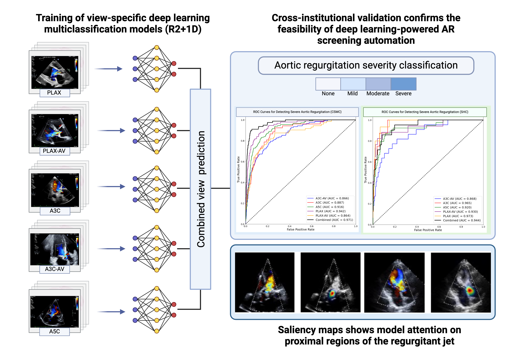

## Predicting Aortic Regurgitation Severity

Accurate evaluation of aortic regurgitation (AR) severity is essential for early detection and effective disease management. While color Doppler echocardiography is the standard diagnostic approach, challenges persist due to variable image quality and the need to integrate information from multiple cardiac views.
\
EchoNet-AR addresses these challenges by training specialized deep learning models on color Doppler echocardiography videos from five distinct transthoracic views: parasternal long-axis (PLAX), parasternal long-axis focused on the aortic valve (PLAX_AV_MV), apical three-chamber (A3C), apical three-chamber focused on the aortic valve (A3C_AV), and apical five-chamber (A5C). Each view is analyzed by its own dedicated model, producing view-specific AR severity predictions.
\
To generate a comprehensive assessment at the patient study level, these view-specific predictions are combined using a maximum-value approach. This method selects the highest severity classification across all available views as the final AR grade, mirroring the clinical practice of identifying the most severe regurgitation present. While EchoNet-AR shows promise as an automated clinical decision support tool, physician interpretation remains essential, particularly in complex cases with multiple valve pathologies or altered hemodynamics.

  

Overview:

This repository contains a deep learning model that predicts the severity of aortic regurgitation (AR) from color Doppler echo videos. The model classifies AR into four categories: "none or trace", "mild", "moderate", and "severe".
Overview
Aortic regurgitation (AR) assessment is an important part of echocardiographic evaluation. The AI model in this repository was trained using a deep learning classification approach on color Doppler echocardiographic videos from different views: 
DOPPLER_PLAX
DOPPLER_PLAX_AV_MV
DOPPLER_A5C
DOPPLER_A3C
DOPPLER_A3C_AV

The model uses a 3D convolutional neural network architecture (R2+1D) which has demonstrated effectiveness in echocardiography tasks.

## Running Inference 
This repo was tested in the January 2024 edition of the official Nvidia PyTorch Docker image, which comes packaged with Python 3.10, PyTorch 2.2, NumPy 1.24.4, and Pandas 1.5.3.

This script accepts a path to a directory containing TTE echoes of the respective view (PLAX, PLAX-AV, A3C, A3C-AV or A5C) in DICOM format, and predicts the severity of aortic regurgitation. \
To run inference: 
1. Download the weights files of the correct view. Place them in the same folder as the scripts predict_ar.py and utils.py.
2. Run the following command:\
    python predict_ar.py --data_path <path_to_directory> --weights_path <path_to_weights_file>
    where **--data_path** is the full path to a directory of DICOM files; files must be of the view corresponding to the view-specific model weights TTEs

Predictions are then saved to a `.csv` file named `predictions_<weights_filename>.csv` which contains a `filename` column and several `predicions` columns.
